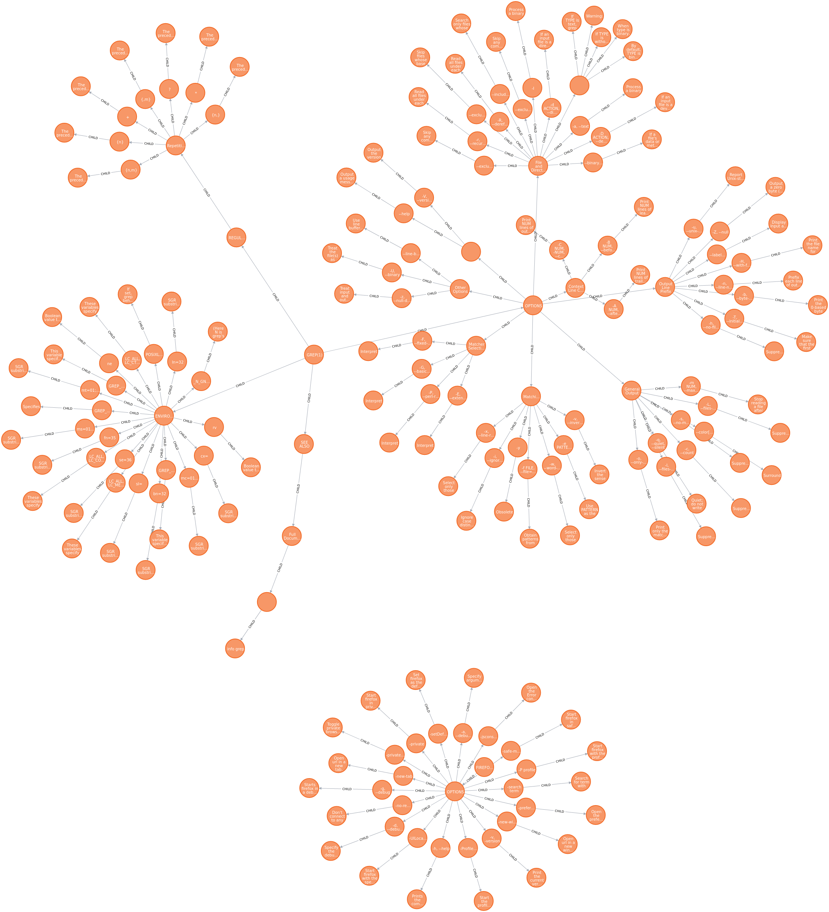

# Linux Manpages to Knowledge Graph

## What is this tool?
This tool is designed to construct population a Neo4j database with information from Manpages. The current version of the tool relies on a conventional organization of Manpages. However, the same convention allows for construction of datasets which maybe for by Machine Learning approaches to the problem.

## How to run
1. Install [Neo4j Bolt](https://neo4j.com/docs/api/python-driver/current/) and [bs4](https://pypi.org/project/beautifulsoup4/) in your Python 3 Environment.
2. Run `python graph.py <command/function>`. (Example: `python graph.py firefox`)
3. Behold a beautiful knowledge graph.

## Sample Graph (GREP and firefox)

